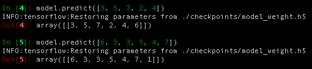

# Seq2Seq
參考[ematvey](https://github.com/ematvey/tensorflow-seq2seq-tutorials)所做的簡單seq2seq模型。

輸入一串介於2~9的數字，模型將返回與輸入值相同的數字串。


## 使用
###訓練:###

```
from seq2seq.utils import random_sequences
from seq2seq.model import Seq2seq

batches = random_sequences() 	# 產生訓練資料(iterator)
model = Seq2seq()
model.train(batches)	 		# 回傳loss history
```
訓練完成後，程式會自行在checkpoints目錄下儲存模型。


###預測:###

```
from seq2seq.model import Seq2seq

model = Seq2seq()
input_seq = [5, 3, 7, 7, 8]
model.predict(input_seq)
```

